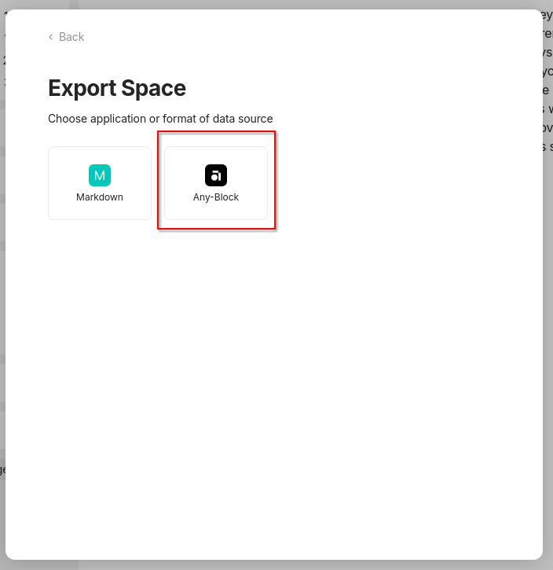
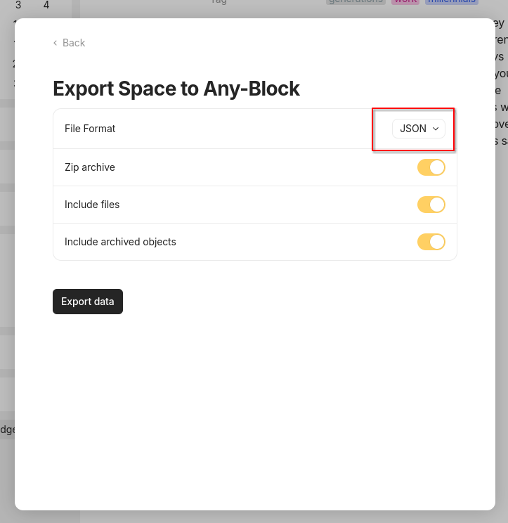
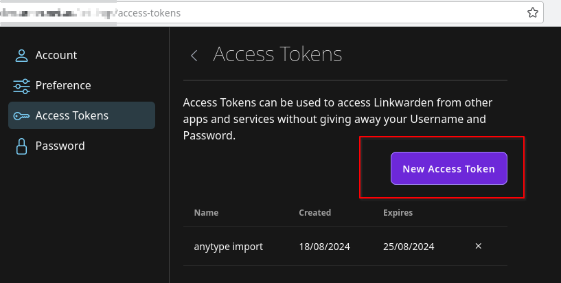

# anytype to linkwarden

This is a quick little script style program that imports ONLY the bookmark's URLs from Anytype with the tags into a linkwarden
collection called: "AnyType".

Everything else you will have to do yourself.

# Usage

You will need to export your AnyType collection to "JSON" format:





Then you will need to have the executable / source of `[migrate-json-export](cmd/migrate-json-export)` available. (Compile it `go build ./cmd/migrate-json-export`, install it, run it using go run `go run ./cmd/migrate-json-export <values>`..)

You will also need to generate an API key from Linkwarden. Only tested on selfhosted:



Extract it:

```bash
unzip x Anytype.20240818.132330.55.zip
```

Once that's assembled you will need export the token to your environment var as: `LINKWARDEN_TOKEN`, ie

```bash
export LINKWARDEN_TOKEN=abc123
```

To run it simply use the following. (Assuming you used `go build`)
```bash
./migrate-json-export -export-dir=./Anytype.20240818.132330.55 -linkwarden-endpoint=https://linkwarden.com
```

But change the values:
* `./Anytype.20240818.132330.55` Should be the directory that was extracted with the zip.
* `https://linkwarden.com` Should be the URL of your instance. Do not include `/api` or some such.

THat run will give you a preview of the data. I have made some assumptions with how AnyType stores it's data. That is subject to change
and you will probably have to adapt the code to make it work.

Once your ready to run it "live" add `-dry=true` to it as follows:
```bash
./migrate-json-export -export-dir=./Anytype.20240818.132330.55 -linkwarden-endpoint=https://linkwarden.com -dry=true
```
